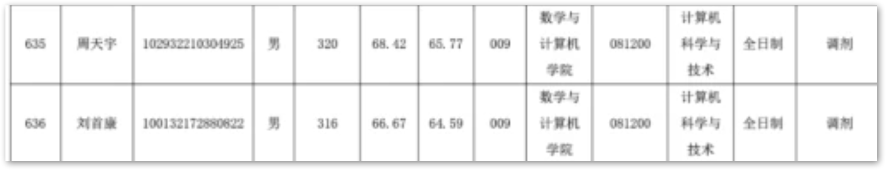

# 广药
只收到0860 生物与医药调剂，但是专业不符合
085410 人工智能
1 健康大数据与智能计算
2 医药信息系统技术

[广东药科大学2022年各学院硕士研究生招生调剂公告](https://yjsxy.gdpu.edu.cn/info/1014/2032.htm)

22数据结构
1. 复试含综合能力面试+实验技能测试（或实践能力测试）
2. 同等学力加试科目：C 语言程序
设计、数据库原理

---
# 广石油
招生咨询电话：0668-2923758
电子信息（学科代码0854，专硕）复试内容

---
# 莞理工
[计算机科学与技术学院-计算机科学与技术专业2022拟录取名单](https://cs.dgut.edu.cn/info/1055/4666.htm)
调剂录取分数线：318
081200计算机科学与技术
001计算机科学与技术学院
1. 物联网技术及应用
2. 智能计算
3. 计算机网络与信息安全
4. 嵌入式系统及应用
5. 工业软件
6. 计算数学

60（含拟推免3人）

初试科目：
11数据结构

复试科目：1.数据库系统原理2.C语言程序设计

招生办电话：0769-22861919
谭老师 0769-22861112
招生办微信公众号：dgutzsb

---

# 广海
初试科目：数据结构

复试科目：547数据库原理

数学与计算机学院联系人：周老师0759-2383064，13560510621

电子信箱：33007248@qq.com

---

# 佛科院
录取分数线最低312的

| |人工智能|软件工程|新一代电子信息技术（含量子技术等）|
| -------- | -------- | ---- |----|
|一志愿|273|273|273|
|调剂|342|328|324|
 
---

[佛山科学技术学院2020-2022年研究生录取最低分数线](https://www.fosu.edu.cn/yanjiusheng/zsgz/zsdt-zsgz/11349.html)

---

# 广技师
[广东技术师范大学2022年硕士研究生招生考试（调剂第一批次）复试名单](https://yjszs.gpnu.edu.cn/info/1154/2033.htm)有3-4批次

| |计算机技术|新一代电子信息技术（含量子技术等）|
| -------- | -------- | ---- |----|
|老师|梁老师|原老师|
|电话|020-38256037|17765262736|

调剂批次多，最低调剂分数线340+

---

# 汕大
[招生简章](http://www.gs.stu.edu.cn/yjszs/master_zsjz.htm)




<!-- tab 新一代电子信息技术 -->
## 新一代电子信息技术（含量子技术等）(085401)(专业型)
拟招人数：11 其中推免：1				
### (01)生物医学信息处理	①101|思想政治理论
②204|英语（二）
③302|数学（二）
④833|微机原理及单片机	①01|综合素质面试
②011|专业知识
③84|毕业设计/论文相关问题
④06|专业英语		电子系
### (02)医学图像处理	①101|思想政治理论
②204|英语（二）
③302|数学（二）
④833|微机原理及单片机	①01|综合素质面试
②011|专业知识
③84|毕业设计/论文相关问题
④06|专业英语		电子系

<!-- endtab -->
<!-- tab 通信工程 -->
## 通信工程（含宽带网络、移动通信等）(085402)(专业型)
拟招人数：14 其中推免：1				
### (01)宽带通信技术及应用	①101|思想政治理论
②204|英语（二）
③302|数学（二）
④833|微机原理及单片机	①01|综合素质面试
②011|专业知识
③84|毕业设计/论文相关问题
④06|专业英语		电子系
### (02)现代信号处理技术及应用	①101|思想政治理论
②204|英语（二）
③302|数学（二）
④833|微机原理及单片机	①01|综合素质面试
②011|专业知识
③84|毕业设计/论文相关问题
④06|专业英语		电子系

<!-- endtab -->
<!-- tab 集成电路工程 -->
## 集成电路工程(085403)(专业型)
拟招人数：2 其中推免：1				
### (00)不分研究方向	①101|思想政治理论
②204|英语（二）
③302|数学（二）
④833|微机原理及单片机	①01|综合素质面试
②011|专业知识
③84|毕业设计/论文相关问题
④06|专业英语		电子系

<!-- endtab -->
<!-- tab 计算机技术 -->
## 计算机技术(085404)(专业型)
拟招人数：8 其中推免：1				佛山基地联合培养1人：广东艾科智泊科技股份有限公司，13531429379；对接汕大导师：周腾0754-86503948
### (00)不分研究方向	①101|思想政治理论
②204|英语（二）
③302|数学（二）
④408|计算机学科专业基础	①50|英语口语及听力测试
②84|毕业设计/论文相关问题	导师组	计算机系

<!-- endtab -->
<!-- tab 软件工程 -->
## 软件工程(085405)(专业型)
拟招人数：8 其中推免：1				佛山基地联合培养1人：佛山鲲鹏现代农业研究院，13811620292；对接汕大导师：周腾0754-86503948
### (00)不分研究方向	①101|思想政治理论
②204|英语（二）
③302|数学（二）
④408|计算机学科专业基础	①50|英语口语及听力测试
②84|毕业设计/论文相关问题	导师组	计算机系

<!-- endtab -->
<!-- tab 光电信息工程 -->
## 光电信息工程(085408)(专业型)
拟招人数：7 其中推免：1				
### (01)光纤传感技术	①101|思想政治理论
②204|英语（二）
③302|数学（二）
④833|微机原理及单片机	①01|综合素质面试
②011|专业知识
③84|毕业设计/论文相关问题
④06|专业英语		电子系
### (02)智能生物感知	①101|思想政治理论
②204|英语（二）
③302|数学（二）
④833|微机原理及单片机	①01|综合素质面试
②011|专业知识
③84|毕业设计/论文相关问题
④06|专业英语		电子系

<!-- endtab -->
<!-- tab 生物医学工程 -->
## 生物医学工程(085409)(专业型)
拟招人数：6 其中推免：1				佛山基地联合培养3人：广东顺德创新设计研究院：0757-223998306；对接汕头导师：郭为进（需求2人）：0754-86502296；马祥园（需求1人）：0754-86502296
### (00)不分研究方向	①101|思想政治理论
②204|英语（二）
③302|数学（二）
④833|微机原理及单片机	①01|综合素质面试
②011|专业知识
③84|毕业设计/论文相关问题
④06|专业英语		电子系

<!-- endtab -->
<!-- tab 人工智能 -->
## 人工智能(085410)(专业型)
拟招人数：36 其中推免：5				
### (01)不区分研究方向（计算机系）
拟招人数：9 其中推免：1	①101|思想政治理论
②204|英语（二）
③302|数学（二）
④408|计算机学科专业基础	①50|英语口语及听力测试
②84|毕业设计/论文相关问题	导师组	计算机系
### (02)人工智能与机器人(电子系)
拟招人数：9 其中推免：1	①101|思想政治理论
②204|英语（二）
③302|数学（二）
④833|微机原理及单片机	①01|综合素质面试
②011|专业知识
③84|毕业设计/论文相关问题
④06|专业英语		电子系
### (03)智能信息物理融合系统(电子系)
拟招人数：7 其中推免：1	①101|思想政治理论
②204|英语（二）
③302|数学（二）
④833|微机原理及单片机	①01|综合素质面试
②011|专业知识
③84|毕业设计/论文相关问题
④06|专业英语		电子系
### (04)群体智能控制(电子系)
拟招人数：8 其中推免：1	①101|思想政治理论
②204|英语（二）
③302|数学（二）
④833|微机原理及单片机	①01|综合素质面试
②011|专业知识
③84|毕业设计/论文相关问题
④06|专业英语		电子系
### (05)智能电网(电子系)
拟招人数：3 其中推免：1	①101|思想政治理论
②204|英语（二）
③302|数学（二）
④833|微机原理及单片机	①01|综合素质面试
②011|专业知识
③84|毕业设计/论文相关问题
④06|专业英语		电子系
<!-- endtab -->

---

# 广东财经
085400电子信息: 273(一志愿) 360(调剂)
信息学院 020-84096433 jammy1124@qq.com
信息很少

<!-- [广东财经录取名单](https://m.juyingonline.com/upload/202204/11/202204110945257857.pdf) -->

电话：020-84096433

邮箱：jammy1124@qq.com

---

# 广西大

---

# 广西师范

---

# 桂林理工

06 信息科学与工程学院
（电话：3698153）
006 081200 计算机科学与技术 一级学科
006 083500 软件工程 一级学科
006 085400 电子信息-02 通信工程-04 计算机技术-05 软件工程 

---

# 桂林电子科技大学

[桂林电子科技大学2022年硕士研究生拟录取名单](http://www.yanxian.org/html/lqmd/66635.html)

---