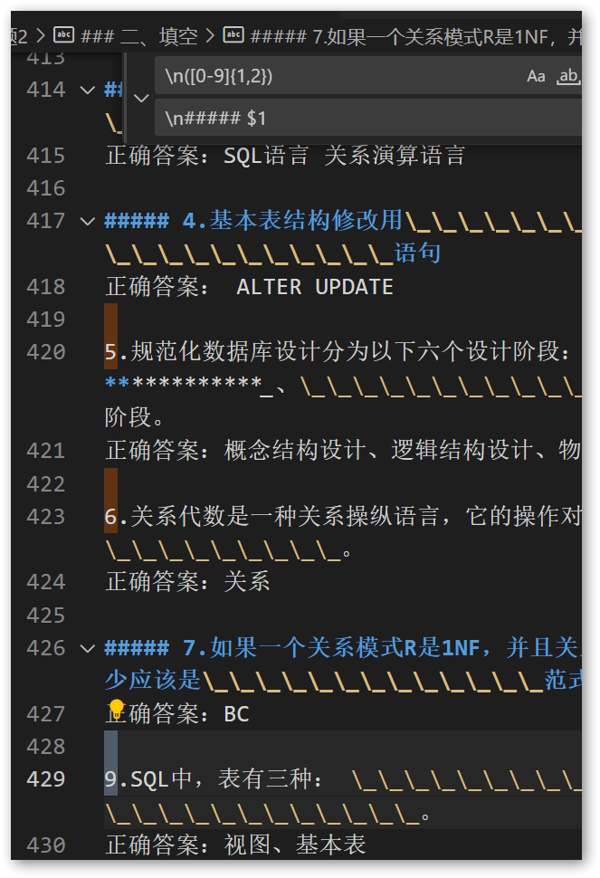

最近用正则表达式时遇到的问题

## 保留部分内容

我们可以使用正则表达式来匹配需要`保留`的部分内容，并将其保存到一个`变量`中，然后在替换过程中将该变量插入到指定位置。

例如，我们要将文本中的所有邮箱地址替换为"**@**.com"，但是要保留邮箱地址的用户名部分。我们可以使用以下正则表达式：

```css
/([a-zA-Z0-9._%+-]+)@([a-zA-Z0-9.-]+\.[a-zA-Z]{2,})/
```

该正则表达式将匹配符合电子邮件地址格式的文本，并将用户名和域名部分分别保存到`两个变量`中。我们可以在替换过程中`使用这两个变量`来保留用户名部分，如下所示：

```javascript
const text = "My email address is john.doe@example.com.";
const regex = /([a-zA-Z0-9._%+-]+)@([a-zA-Z0-9.-]+\.[a-zA-Z]{2,})/;
const replacement = "**@**.com";
const result = text.replace(regex, `$1${replacement}`);
console.log(result); // My email address is john.doe**@**.com.
```

在上面的示例中，我们使用了`$1`来表示正则表达式中第一个匹配的分组，即用户名部分。

再举个简单的例子



我们需要把每个题号都加上`#####`，使得题目能个加粗显示，但我又不需要改变题号。

所以我用`()`括住了`[0-9]{1,2}`声明成变量，在替换框用`$1`使用变量